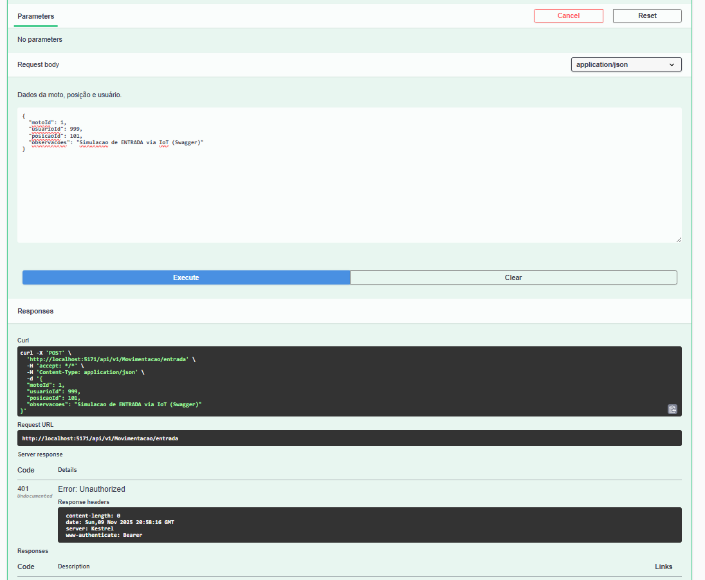
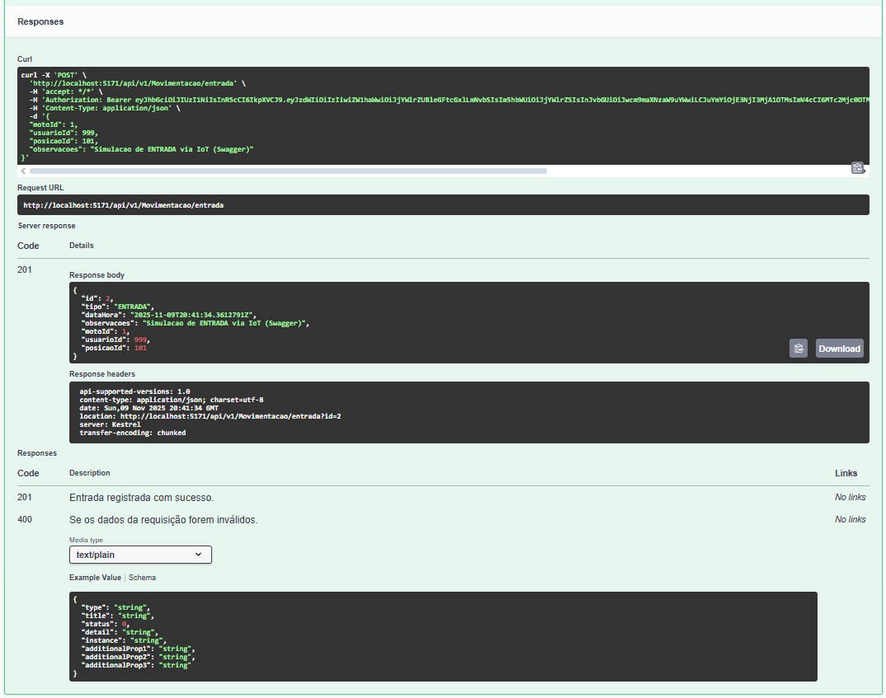
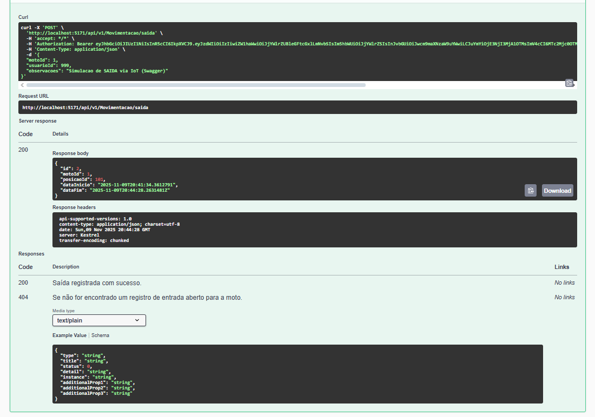

# 🚀 Sprint 4: IoT & Integração API .NET (Mottu)

Este projeto demonstra a integração de um dispositivo IoT (simulado) com a API de backend .NET do projeto MotoMap, cumprindo os requisitos da 4ª Sprint da disciplina de Arquiteturas Disruptivas.

O objetivo é simular um sensor de vaga inteligente que registra automaticamente a **Entrada** e **Saída** de motos, comunicando-se de forma segura com a API principal.

---

### 📺 Vídeo de Demonstração (YouTube)

LINK DO VIDEO - https://www.youtube.com/watch?v=ppAj7h7pa_U

---

### 1. Fluxo Completo de Dados (Ponta a Ponta)

O fluxo de dados segue a arquitetura "sensor-para-servidor":

1.  **Sensor (Hardware):** Um dispositivo (ESP32) monitora uma vaga de estacionamento.
    * Um sensor ultrassônico detecta a **distância** (livre/ocupada).
    * Um leitor RFID (simulado) detecta a `motoId` quando a moto estaciona.
2.  **Lógica do Dispositivo:** O código do ESP32 (arquivo `.ino`) identifica dois eventos:
    * **Evento de Entrada:** Se (distância < 50cm) E (vaga estava livre), o dispositivo captura a `motoId` e a `posicaoId`.
    * **Evento de Saída:** Se (distância > 50cm) E (vaga estava ocupada), o dispositivo sabe qual `motoId` estava lá.
3.  **Integração (API):** O dispositivo se conecta ao Wi-Fi e envia os dados para a API .NET, que está segura.
    * Para se autenticar, o dispositivo envia um `Bearer Token` (JWT) no cabeçalho da requisição.
    * **Em caso de Entrada:** Faz um `POST /api/v1/Movimentacao/entrada` com o JSON: `{ motoId, usuarioId, posicaoId }`.
    * **Em caso de Saída:** Faz um `POST /api/v1/Movimentacao/saida` com o JSON: `{ motoId, usuarioId }`.
4.  **Visualização (Dashboard):** A API .NET salva os dados no banco, e o frontend (Mobile ou Web) pode ler essa informação para exibir o mapa do pátio atualizado em tempo real.

---

### 2. Código-Fonte (IoT)

O código-fonte completo do dispositivo ESP32, escrito em C++ (Arduino), está localizado na pasta `dispositivo-iot`. O código inclui a lógica de estado (livre/ocupada) e a comunicação HTTP segura com a API.

* **Ver Código-Fonte:** [`./dispositivo-iot/vaga_sensor_iot.ino`](./dispositivo-iot/vaga_sensor_iot.ino)

---

### 3. Demonstração Funcional (Artifacts)

Como o hardware físico não era obrigatório, a funcionalidade foi comprovada através de simulação via Swagger. Os artefatos (screenshots) abaixo comprovam o funcionamento.

#### Prova de Segurança (Falha 401)
A API corretamente bloqueia requisições sem o token de autenticação JWT.

#### Prova de ENTRADA (Sucesso 200)
Simulação do envio de uma moto para a vaga 101, com o JSON correto (`motoId`, `posicaoId`, `usuarioId`). A API responde com 200 OK.

#### Prova de SAÍDA (Sucesso 200)
Simulação da saída da mesma moto, com o JSON correto (`motoId`, `usuarioId`). A API responde com 200 OK.
